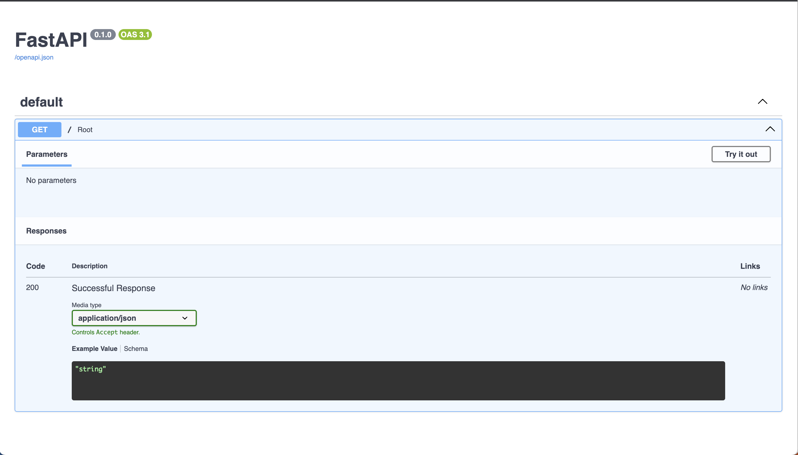
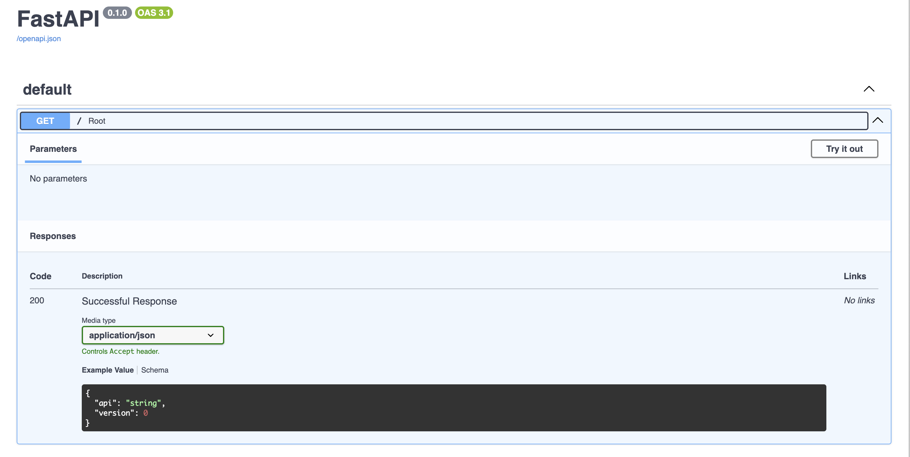

# FastAPI

小獅：好了，檢查點寫完了，FastAPI 也沒多厲害啊！和 flask 差不多嘛？

老獅：你可以用瀏覽器打開 `http://localhost:8000/docs` 看看



小獅：喔，有整合 OpenAPI document，但是好像給的資訊沒有很完整

老獅：那是你寫的不完整，把那隻 API 加上 `Response Model` 看看

## Response Model
老獅：我們可以先定義好我們要回傳的格式

```python
# src/app/schemas/health_check.py
import typing

import pydantic


class HealthResponse(pydantic.BaseModel):
    api: str
    version: typing.Optional[int] = None
```

```python
# src/app/main.py
import fastapi

from app.schemas import health_check

app = fastapi.FastAPI()


@app.get("/", response_model=health_check.HealthResponse)
def root():
    return {"api": "fastit"}
```



小獅：看起來真的清楚多了，以後就可以寫完以後叫前端自己去看了吧，嘿嘿

老獅：還是要溝通拉，但是大部分的案例，有經驗的前端可以更快速上手

```
git add src/app/schemas
git add src/app/main.py

git commit -m "feat: add health check response model"
```
## Async
老獅：除了文件以外，FastAPI 還有支援原生的非同步，對於 HTTP 服務的效能來說，在不少情況下都有顯著的優化

```shell
# 使用 k6 對同步的程式進行壓力測試
k6 run --vus 10 --duration 30s http_get.js

          /\      |‾‾| /‾‾/   /‾‾/
     /\  /  \     |  |/  /   /  /
    /  \/    \    |     (   /   ‾‾\
   /          \   |  |\  \ |  (‾)  |
  / __________ \  |__| \__\ \_____/ .io

  execution: local
     script: http_get.js
     output: -

  scenarios: (100.00%) 1 scenario, 10 max VUs, 1m0s max duration (incl. graceful stop):
           * default: 10 looping VUs for 30s (gracefulStop: 30s)


     data_received..................: 19 MB  641 kB/s
     data_sent......................: 9.9 MB 329 kB/s
     http_req_blocked...............: avg=785ns  min=0s     med=0s     max=4.13ms p(90)=1µs    p(95)=1µs
     http_req_connecting............: avg=135ns  min=0s     med=0s     max=2.06ms p(90)=0s     p(95)=0s
     http_req_duration..............: avg=2.41ms min=1.19ms med=2.39ms max=8.32ms p(90)=2.75ms p(95)=2.91ms
       { expected_response:true }...: avg=2.41ms min=1.19ms med=2.39ms max=8.32ms p(90)=2.75ms p(95)=2.91ms
     http_req_failed................: 0.00%  ✓ 0           ✗ 123311
     http_req_receiving.............: avg=9.04µs min=3µs    med=8µs    max=2.94ms p(90)=10µs   p(95)=14µs
     http_req_sending...............: avg=1.98µs min=1µs    med=2µs    max=1.45ms p(90)=2µs    p(95)=3µs
     http_req_tls_handshaking.......: avg=0s     min=0s     med=0s     max=0s     p(90)=0s     p(95)=0s
     http_req_waiting...............: avg=2.4ms  min=1.18ms med=2.37ms max=5.97ms p(90)=2.74ms p(95)=2.89ms
     http_reqs......................: 123311 4110.097729/s
     iteration_duration.............: avg=2.43ms min=1.2ms  med=2.4ms  max=14ms   p(90)=2.76ms p(95)=2.92ms
     iterations.....................: 123311 4110.097729/s
     vus............................: 10     min=10        max=10
     vus_max........................: 10     min=10        max=10


running (0m30.0s), 00/10 VUs, 123311 complete and 0 interrupted iterations
default ✓ [======================================] 10 VUs  30s
```

現在我們將其改寫成非同步的版本
```python
# src/app/main.py
import fastapi

from app.schemas import health_check

app = fastapi.FastAPI()


@app.get("/", response_model=health_check.HealthResponse)
async def root():
    return {"api": "fastit"}
```
同樣進行壓力測試
```shell
# 使用 k6 對非同步的程式進行壓力測試
k6 run --vus 10 --duration 30s http_get.js

          /\      |‾‾| /‾‾/   /‾‾/
     /\  /  \     |  |/  /   /  /
    /  \/    \    |     (   /   ‾‾\
   /          \   |  |\  \ |  (‾)  |
  / __________ \  |__| \__\ \_____/ .io

  execution: local
     script: http_get.js
     output: -

  scenarios: (100.00%) 1 scenario, 10 max VUs, 1m0s max duration (incl. graceful stop):
           * default: 10 looping VUs for 30s (gracefulStop: 30s)


     data_received..................: 39 MB  1.3 MB/s
     data_sent......................: 20 MB  664 kB/s
     http_req_blocked...............: avg=639ns  min=0s       med=0s     max=4.25ms p(90)=1µs    p(95)=1µs
     http_req_connecting............: avg=59ns   min=0s       med=0s     max=2.35ms p(90)=0s     p(95)=0s
     http_req_duration..............: avg=1.18ms min=215µs    med=1.18ms max=5.87ms p(90)=1.23ms p(95)=1.27ms
       { expected_response:true }...: avg=1.18ms min=215µs    med=1.18ms max=5.87ms p(90)=1.23ms p(95)=1.27ms
     http_req_failed................: 0.00%  ✓ 0           ✗ 249101
     http_req_receiving.............: avg=9.86µs min=3µs      med=7µs    max=1.57ms p(90)=20µs   p(95)=27µs
     http_req_sending...............: avg=1.93µs min=1µs      med=2µs    max=2.1ms  p(90)=2µs    p(95)=3µs
     http_req_tls_handshaking.......: avg=0s     min=0s       med=0s     max=0s     p(90)=0s     p(95)=0s
     http_req_waiting...............: avg=1.17ms min=202µs    med=1.17ms max=5.86ms p(90)=1.22ms p(95)=1.26ms
     http_reqs......................: 249101 8303.043402/s
     iteration_duration.............: avg=1.2ms  min=234.45µs med=1.19ms max=8.31ms p(90)=1.24ms p(95)=1.28ms
     iterations.....................: 249101 8303.043402/s
     vus............................: 10     min=10        max=10
     vus_max........................: 10     min=10        max=10


running (0m30.0s), 00/10 VUs, 249101 complete and 0 interrupted iterations
default ✓ [======================================] 10 VUs  30s
```

可以看到對大部分的等待時間都有幫助，畢竟前面的不會因為 IO 而擋住後面的請求

```shell
git add src/app/main.py
git commit -m "perf: use async programming to speep up the API"
```

小獅：他是怎麼辦到的？

老獅：他是透過作業系統提供的系統呼叫 `select`, `poll`, `epoll` 等方法，當系統發現該等待的工作完成了，才讓你做下一步驟，其他時間你可以去做別的事情，由於太底層有興趣可以去自己找相關文件，下面是虛擬碼供參考

```python
# os process 1: 註冊需要等待的程式，當硬體完成 IO 工作後，會通知作業系統
while True:
    for awaitable in os.await_list:
        register_callback_and_run(awaitable)

# os process 2: 收到完成通知，將工作還給 app
while True:
    for job in callbacks:
        os.runable.append(job)

# app 僅執行需要做的事情，IO 相關的程式丟給作業系統去管理等待
# 注意：此處為 event loop 的精髓，你的程式就真的只有一隻執行序在跑一個 loop
while True:
    # 如果有已經等待完系統呼叫的程式可以繼續往下執行我們就跑他
    if os.runable:
        job = os.runable.popleft()
        res = run(job)
        if inspect.isawaitable(res):
            # 如果又要做 IO 就丟給 OS 去等待，我們就可以去下一個迴圈處理已經等待完的工作
            os.await_list.append(res)
```

## 本次目錄
```
.
├── docs
│   ├── ...
│   └── day6.md
├── pyproject.toml
├── requirements
│   ├── base.in
│   ├── base.txt
│   ├── development.in
│   └── development.txt
├── requirements.txt
├── setup.cfg
└── src
    ├── app
    │   ├── __pycache__
    │   ├── api
    │   │   └── v1
    │   │       └── endpoints
    │   │           └── __init__.py
    │   ├── crud
    │   ├── db
    │   ├── main.py                # 更改
    │   ├── migrations
    │   ├── models
    │   └── schemas
    │       └── health_check.py    # 新增
    ├── core
    ├── scripts
    └── tests
```
